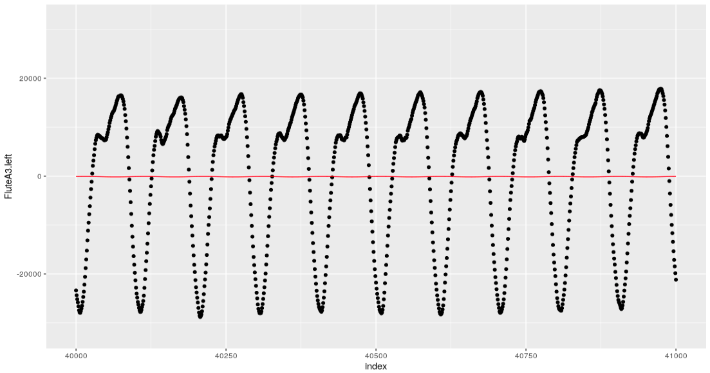

Instrument Classification
================
Nolan Anderson, Tim Shinners, Sarah Maebius

Project Description
===================

The purpose of this project is to examine whether we can build a model that predicts the instrument being played from a sound recording. This project will utilize data from isolated sound recordings of different instruments being played, with possible predictors relating to unexplained differences in the frequency wave patterns, the modulation of frequency or amplitude over time, or the prevalence of different overtones in the sound. The goal will be to predict the instrument being played based on a test sound recording.

Gathering Data
==============

The data used to construct this classification model came from clips of audio recordings made in GarageBand. For 5 different instruments, we played and recorded 10 notes (C3, D3, E3, F3, G3, A3, B3, C4, D4, E4) then exported these clips as MP3 files to RStudio. The `tuneR` package provides convenient functions for reading these files as “Wave” objects which contains information about the audio file including the left and right channels, frequency, and amplitude. The five intruments that we collected sound recordings from are the violin, flute, piano, guitar, mandolin, and ukulele. In total, we have 65 observations of data (10 for each instrument expect piano, which has 15). The number of predictors is potentially infinite, but extracting these predictors will likely be the most difficult and critical part of this project. Realistically, we hope to use around 5-10 predictors relating to attack and decay of the note, the volume of different overtone frequencies present in the signal, and the residuals from fitting a sine curve to the data. Having extracted these features, we will apply various different classification methods from this course to attempt to predict the instrument. We might expect any such model to distinguish some instruments more easily than others. For example, even a human listener might have a hard time distinguishing between the exact same note played on a ukulele and guitar.

Data Analysis
=============

In theory, we may be able to tell instruments apart based on nuanced qualities of their waveforms. For example, the three images below show waveforms from recordings of flute, violin, and ukulele. Despite the similarities, they seem distinct enough that a casual human observer could conceivably begin to tell apart these instruments just by looking at graphs like these. Conceptually, we hope to extract features from them that may allow a computer to do the same.

  

The features that we intend to extract from our observations are some measurement for the attack of the note, some measure of the decay, and some measure of the tonal qualities of the note. By using the periodogram function, we were able to create a function that returns a data frame that identifies the main frequencies in a wave object, along with their relative loudness. This will allow us to investigate the tonal qualities of each instrument. Using the periodogram function, we were able to create a data frame that lists frequencies and their relative loudness in a recording. Below is a plot of this data frame for a violin recording.

From here, we made a function that filtered out all points that weren't a local maximum, and that were smaller than 0.01 of the maximum value in the set. The resulting data frame only includes points at the top of nodes seen in the plot above. Below is a plot of this resulting data frame.

To analyze the attack and decay of each note, we started with a data frame that held a measurement for volume over a long list of times. An illustration of this for a Ukulele note is shown below.

We then created a function that filtered out all values that weren't local maxima, and then filtered out all values that were smaller than a certain threshold. After this, the function rescaled the units of time to actually reflect time in seconds. It also rescaled the height to have a maximum of one, allowing us to compare the decay of a note without worrying about its actual volume. The resulting data frame is illustrated below.

Our intent is to then cut this data frame into separate "attack" and "decay" sets, and then potentially classify instruments by their attack and decay as either "plucked", "hammered", or "sustained" by fitting different types of regression models to each data set and calculating the MSE for each type.

### Fiting a Sine Curve

One way to try to pick up on nuanced differences in the waveforms would be to fit a sine curve to the data, and perform analysis on the residuals. However, this proves to be a much more difficult task than one might expect. A general sine curve with constant wavelength and amplitude can be written as *A* + *B*sin(*C**x* − *D*), thus there are at least four parameters to estimate which can be thought of as the horizontal and vertical shift of the curve, as well as controls for wavelength and amplitude. Each of these parameters is necessary to obtain a good fit for an arbitrary curve. We attempt to do this by defining a loss function $\\sum\_{i=1}^{n}(y\_i-(A+B\\sin(Cx\_i-D)))^2$ (where n is the number of samples in the part of the sound file we are analyzing) and finding a minimum using the optim function in r. From a given starting point, this function searches for a local minima using several possible established methods. While simple in theory, it turns out that it is nearly impossible for algorithmic search functions to find the true best sine fit over these four parameters without being given very good starting values for most of the parameters. Conceptually, this is because the loss function is very sensitive to each of the parameters, thus the global minima (the true best fit sine curve) is surrounded by very large values and thus hard for an algorithm to find based on gradients. For example, even if the amplitude, wavelength, and vertical shift parameters are very well tuned, a bad horizontal shift will produce massive residuals which can be reduced by decreasing amplitude towards zero. The main solution to this problem is to attempt to find a very good starting point for the minimization search function. We do this by estimating values for amplitude, vertical shift, and frequency. The fundamental frequency can be estimated by the periodogram, while the amplitude can be estimated as the half the difference between the min and max of the wave and the vertical shift can be estimated as the halfway point between the min and max. So far, we have mixed success with using this method. However, we hope to improve our method enough to be able to extract features from it, such as the mean squared residuals from the sinusoidal regression, and residual frequencies in the signal (indicating frequency patterns that the sine wave was not able to account for)

 A poor fitting sine curve generated by the optim function. The amplitude is suppressed to a very small number to essentially draw a line through the center of the data. The vertical shift is close to zero, but not exactly zero. It appears to be above center because of the clustering of data at the peaks of the waves, at least in the case of this flute sample.

 A better sine curve fit obtained by restricting most of the parameters to estimates and simply fitting the horizontal shift.
