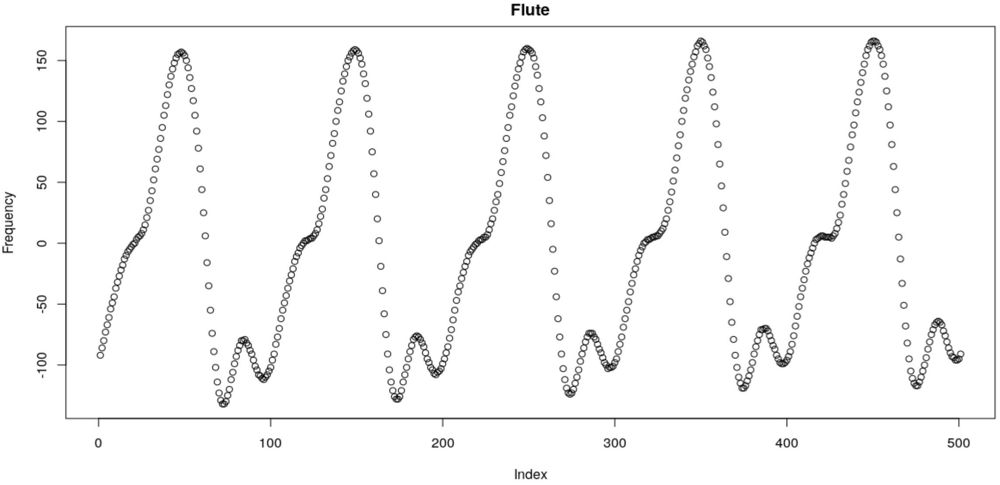
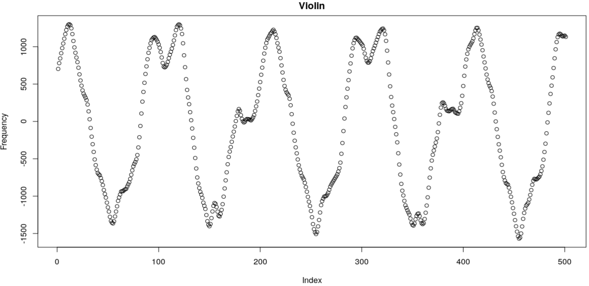
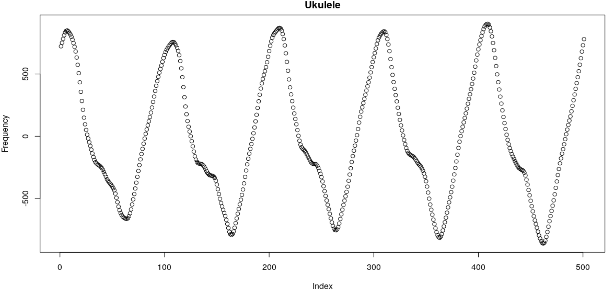
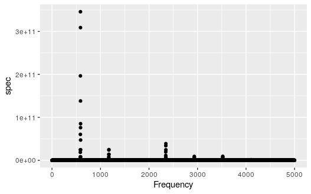
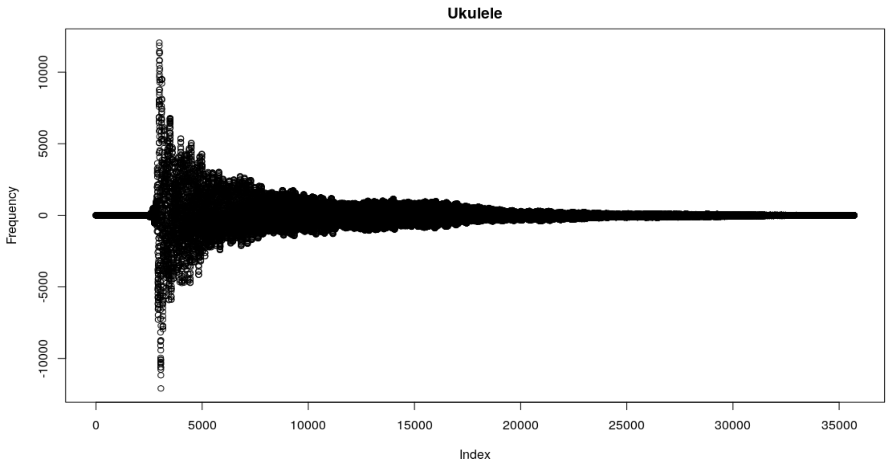
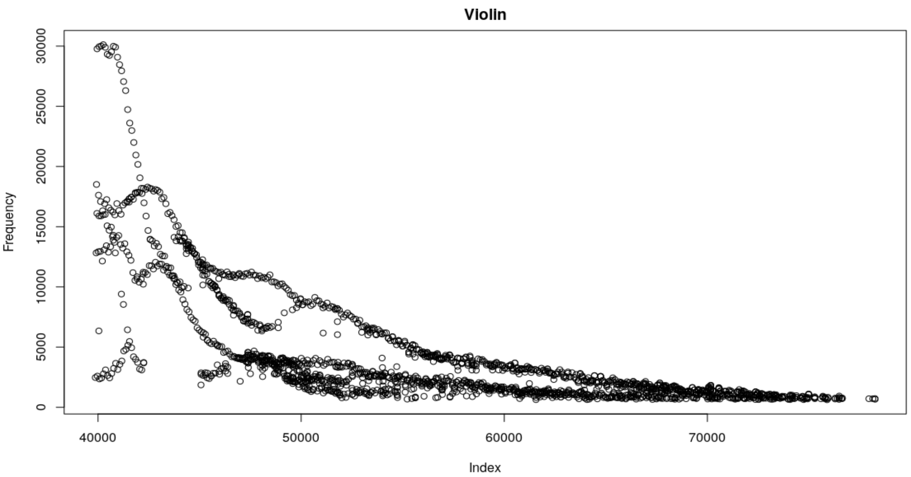
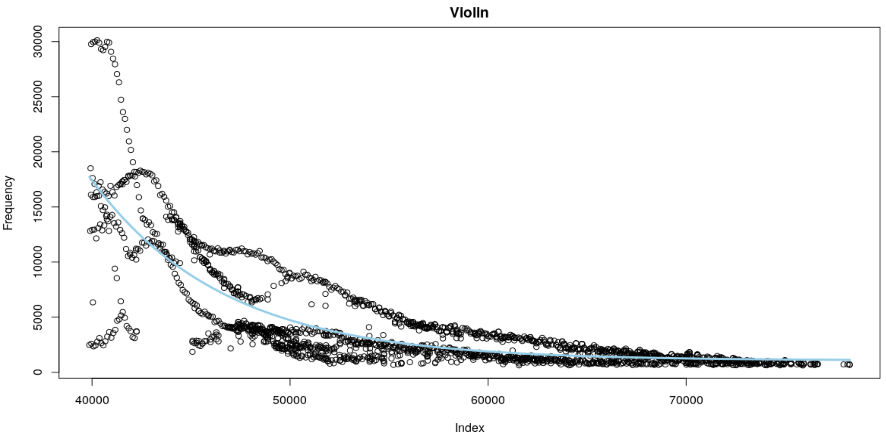
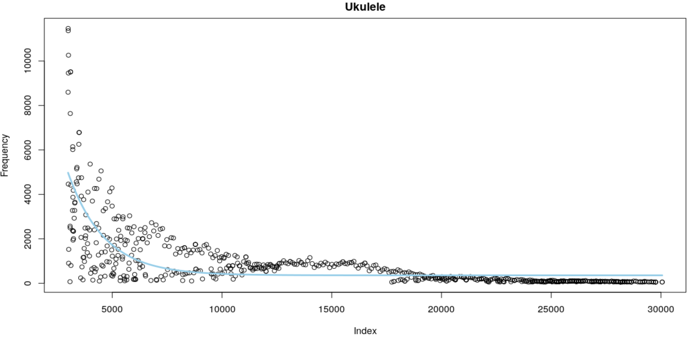
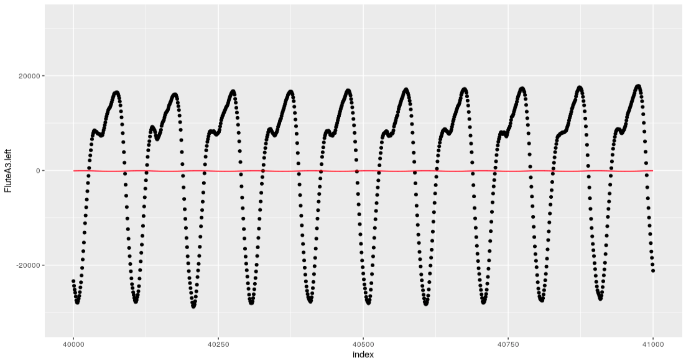
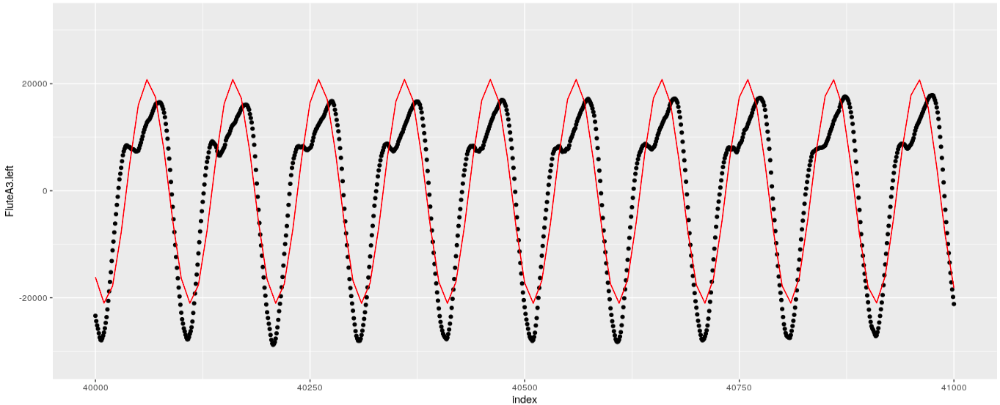

```{r setup, include=FALSE}
knitr::opts_chunk$set(echo = F)
```

```{r}
library(knitr)
```


Abstract
==========

  Musical instruments produce sound by generating rapid vibrations of a string or air in a tube that eventually reach our ears. Humans can recognize the sounds of notes played by different instruments because instruments such as a flute or a violin produce sound waves differently. The purpose of this project is to build a model that can also distinguish between the sound waves played by instruments and ultimately predict an instrument from an audio file. The approach to this analysis was to create predictors that measure factors such as harmonic frequencies or overtones, which differ across instruments. We found that applying statistical learning models like random forest, boosted trees, and multiple logistic regression produced results that performed well overall on the training data, but only slightly better than random chance on the testing data.

Introduction
==========

  The purpose of this project is to examine whether we can build a model that predicts the instrument being played from a sound recording. This project will utilize data from isolated sound recordings of different instruments being played, with predictors related to differences in the frequency wave patterns, the modulation of frequency or amplitude over time, or the prevalence of different overtones in the sound. The goal will be to predict which instrument is being played based on a sound recording.
  Previous research has been conducted to try and predict the instrument played from a recording, and most involve fitting a sine curve to the sound waves in the audio file. However, our research could not determine the exact process behind fitting this curve to the sound wave, so our version involves summing up multiple sine curve fits. In Rafael Irizarry's $Music\ and\ Statistics\ Demo$, local harmonic estimation is used to separate the musical signals in a recording from the 'bare' sounds of the instruement. For example, taking the residuals from the sine curve of a flute should generate a wave that sounds like air blowing through a tube, and we expect violin residuals to sound like bow hairs sliding across steel strings. Our analysis also invloves exploring this relationship and attempts to reproduce Irizarry's results.

The Data
==========

  The data used to train this classification model came from sound recordings available on https://www.philharmonia.co.uk/ as well as track recordings made by software instruments in the GarageBand Electric Music Sound Library. For 6 different instruments, we downloaded 10 notes as MP3 files and then exported them to RStudio. The `tuneR` package provided convenient functions for reading these files as “Wave” objects which contains information about the audio file including the left and right channels, frequency, and amplitude. The six instruments from which we collected sound recordings are violin, flute, piano, guitar, mandolin, and ukulele. In total, we have 60 observations of data (10 for each instrument). 
  For our testing data, we recorded ourselves playing the six instruments, and followed the same pattern of 10 notes per instrument.
  We used around 5-10 predictors that relate to attack, decay, volume of different overtone frequencies, and the residuals from fitting a sine curve to the data.


Exploratory Data Analysis
==========
  
  The features that we intend to extract from our observations are some measurement for the attack of the note, some measure of the decay, and some measure of the tonal qualities of the note.

  In theory, we should be able to tell instruments apart based on qualities of their waveforms. For example, the three images below show waveforms from recordings of flute, violin, and ukulele. Despite similarities, they seem distinct enough that a human observer could tell these instruments apart solely by looking at graphs like these. 

  
  
  

###Tonal Quality

  In order to extract a value relating to the shape of the waveforms, we opted to fit a sine wave to each waveform and then record the MSE and RSS. This produced a reasonable value for how much each waveform resembled a sine wave. A lower value implied a more pure signal, while a higher value meant the waveform was more messy.

  To extract more features of tonal quality, we wanted to identify which frequencies were loudest in each recording. By using the periodogram function, we were able to see a list of frequencies and their relative loudness, shown below.
  
  

  From here, we made a function that filtered out all points that weren't a local maximum, and that were smaller than 0.01 of the maximum value in the set. The resulting data frame only includes points at the top of the peaks seen in the plot above. The function then rescaled the data so that the volume of the loudest frequency was equal to 1. Below is a plot of this resulting data frame. 

  
  
  For each instrument recording, we extracted the number of points, the median loudness, and the ratio between the lowest and second lowest frequencies, in an attempt to use what we thought would be the most identifiable traits of the data set as predictors.

###Attack and Decay
  One measurement that distinguishes between the sound waves produced by vibrations of different surfaces is the attack of a note played by an instrument. Attack is the initial spike in volume as the level shifts from silence to its maximum level of amplitude. The technique behind playing a wind or plucked instrument suggests that the attack is short and sharp, whereas, a stringed instrument that requires a bow typically has a longer attack. The attack predictor included in our model measures the horizontal distance between the start of the note and the maximum amplitude.
  Another predictor related to the amplitude of the note is the decay: the rate at which a sound dies off to silence. For this measurement, we expect a plucked instrument to have a straightforward exponential decay to reflect the fast vibrations that occur just after being pulled back from equilibrium and released followed by the gradual decline in amplitude over time. On the other hand, a flute undergoes decay that is not quite as exponential, since the instrument produces music by blowing air through a tube, and the rate of decay depends on how long the musician holds onto the note.
  Since most instruments experience some amount of exponential decay over time in the form of $amplitude = e^{\beta_0 *time}$, we created a decay predictor by fitting a linear model to the log of the amplitude over time and extracting the coefficient of the model $log(amplitude) = \beta_0*time$.

  To analyze the attack and decay of each note, we started with a data frame that held a measurement for volume over a long list of times. An illustration of this for a Ukulele note is shown below. 
  
  

  We then created a function that filtered out all values that weren't local maxima, and then filtered out all values that were smaller than a certain threshold. After this, the function rescaled the units of time to actually reflect time in seconds. It also rescaled the volume to have a maximum of one, allowing us to compare the decay of a note without worrying about its volume relative to other instruments. The resulting data frame is illustrated below. 

  
  Our measurement of attack was then the time difference between the start of the note and the maximum volume. The predictor for decay consisted of the coefficient, $R^2$ value, and $t$ statistic from the linear regression on $log(Amplitude) \sim time$.





###Fitting a Sine Curve
  One way to try to pick up on nuanced differences in the waveforms would be to fit a sine curve to the data, and perform analysis on the residuals. However, this proves to be a much more difficult task than one might expect. A general sine curve with constant wavelength and amplitude can be written as $A+B\sin(Cx-D)$, thus there are at least four parameters to estimate which can be thought of as the horizontal and vertical shift of the curve, as well as controls for wavelength and amplitude. Each of these parameters is necessary to obtain a good fit for an arbitrary curve. We attempt to do this by defining a loss function $\sum_{i=1}^{n}(y_i-(A+B\sin(Cx_i-D)))^2$ (where n is the number of samples in the part of the sound file we are analyzing) and finding a minimum using the optim function in r. From a given starting point, this function searches for a local minima using several possible established methods. While simple in theory, it turns out that it is nearly impossible for algorithmic search functions to find the true best sine fit over these four parameters without being given very good starting values for most of the parameters. Conceptually, this is because the loss function is very sensitive to each of the parameters, thus the global minima (the true best fit sine curve) is surrounded by very large values and thus hard for an algorithm to find based on gradients. For example, even if the amplitude, wavelength, and vertical shift parameters are very well tuned, a bad horizontal shift will produce massive residuals which can be reduced by decreasing amplitude towards zero. 
  The main solution to this problem is to attempt to find a very good starting point for the minimization search function. We do this by estimating values for amplitude, vertical shift, and frequency. The fundamental frequency can be estimated by the periodogram, while the amplitude can be estimated as the half the difference between the min and max of the wave and the vertical shift can be estimated as the halfway point between the min and max. So far, we have mixed success with using this method. However, we hope to improve our method enough to be able to extract features from it, such as the mean squared residuals from the sinusoidal regression, and residual frequencies in the signal (indicating frequency patterns that the sine wave was not able to account for)


  
A poor fitting sine curve generated by the optim function. The amplitude is suppressed to a very small number to essentially draw a line through the center of the data. The vertical shift is close to zero, but not exactly zero. It appears to be above center because of the clustering of data at the peaks of the waves, at least in the case of this flute sample.

  
A better sine curve fit obtained by restricting most of the parameters to estimates and simply fitting the horizontal shift.


Modeling
==========

  Among the modeling approaches that we considered were a random forest model, boosted tree, multiple logistic regression, and QDA. We found that the random forest model performed the best in terms of overall misclassification rate as well as misclassifications across the individual instruments.
  
```{r}
Models <- c("Random Forest", "Boosted Tree", "Multinomial Logistic", "QDA")
Overall_misclass_rate <- c(0.46, 0.72, 0.52, 0.54)
flute_misclass <- c(0.0, 0.1, 0.4, 0.4)
guitar_misclass <- c(0.8, 0.7, 0.9, 0.3)
mandolin_misclass <- c(1.0, 0.7, 0.9, 1.0)
piano_misclass <- c(0.33, 0.8, 0.27, 0.67)
ukulele_misclass <- c(0.0, 1.0, 0.3, 0.7)
violin_misclass <- c(0.7, 1.0, 0.5, 0.1)
table <- rbind(Models, Overall_misclass_rate, flute_misclass, guitar_misclass, mandolin_misclass, piano_misclass, ukulele_misclass, violin_misclass)

table <- data.frame("Models" = Models, "Overall Misclassification Rate" = Overall_misclass_rate,
                       "Flute Misclassification" = flute_misclass, 
                       "Guitar Misclassification" = guitar_misclass, 
                       "Mandolin Misclassification" = mandolin_misclass, 
                       "Piano Misclassification" = piano_misclass, 
                       "Ukulele Misclassification" = ukulele_misclass, 
                       "Violin Misclassification" = violin_misclass)

Table <- as.data.frame(t(as.matrix(table)))

kable(Table)
```

Discussion
==========


References
==========

http://www.biostat.jhsph.edu/~ririzarr/Demo/

https://amstat.tandfonline.com/doi/pdf/10.1198/016214501753168082?needAccess=true