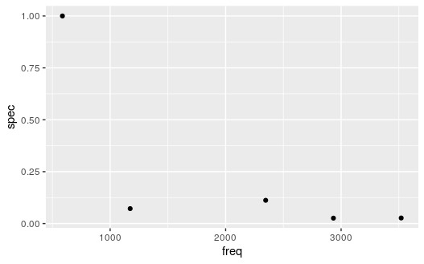
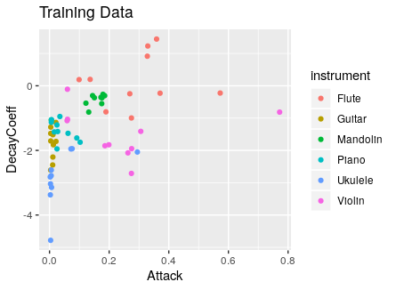
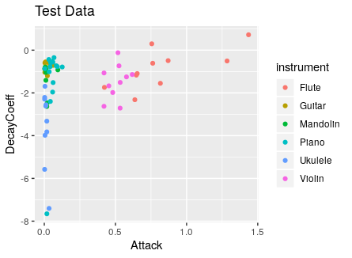
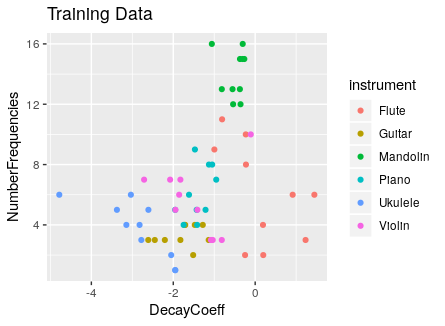

```{r setup, include=FALSE}
knitr::opts_chunk$set(echo = F)

```

```{r message=F, include=F}
library(knitr)
```


Abstract
==========

  Musical instruments produce sound by generating rapid vibrations of a string or air in a tube that eventually reach our ears. Humans can recognize the sounds of notes played by different instruments because instruments such as a flute or a violin produce sound waves differently. The purpose of this project is to build a model that can also distinguish between the sound waves played by instruments and ultimately predict an instrument from an audio file. The approach to this analysis was to create predictors that measure factors such as harmonic frequencies or overtones, average errors from fitting a sine curve, and measures of attack and decay of the note which differ across instruments. We found that applying statistical learning models like random forest, boosted trees, and multiple logistic regression produced results that performed well overall on the training data (cross validation estimates of misclassification rates were as low as 0.23), but not quite as well when determining external validity by using test data from a different source (our best test misclassification rates are around 0.43).

Introduction
==========

  The purpose of this project is to examine whether we can build a model that predicts the instrument being played from a sound recording. This project will utilize data from isolated sound recordings of different instruments being played, with predictors related to differences in the frequency wave patterns, the modulation of frequency or amplitude over time, or the prevalence of different overtones in the sound. The goal will be to predict which instrument is being played based on a sound recording.
  Previous research has been conducted to try and predict the instrument played from a recording, and most involve fitting a sine curve to the sound waves in the audio file. However, our research could not determine the exact process behind fitting this curve to the sound wave, so our version involves summing up multiple sine curve fits. In Rafael Irizarry's $Music\ and\ Statistics\ Demo$, local harmonic estimation is used to separate the musical signals in a recording from the 'bare' sounds of the instrument. For example, taking the residuals from the sine curve of a flute should generate a wave that sounds like air blowing through a tube, and we expect violin residuals to sound like bow hairs sliding across steel strings. Our analysis also involves exploring this relationship and attempts to reproduce Irizarry's results.

The Data
==========

  The data used to train this classification model came from sound recordings available on https://www.philharmonia.co.uk/ as well as track recordings made by software instruments in the GarageBand Electronic Music Sound Library. For 6 different instruments, we downloaded 10 notes as MP3 files and then exported them to RStudio. The `tuneR` package provided convenient functions for reading these files as “Wave” objects which contains information about the audio file including the left and right channels, frequency, and amplitude. The six instruments from which we collected sound recordings are violin, flute, piano, guitar, mandolin, and ukulele. In total, we have 60 observations of data (10 for each instrument). For our test data, we recorded ourselves playing the six instruments, and followed the same pattern of 10 notes per instrument. 
We chose to use professionally recorded training data because the samples were cleaner and there was less white noise. This let us extract accurate predictors and form the best possible representation of each instrument. For test data, we opted to make our own recordings, as this would let us assess our models’ accuracy if used by a “normal” person. 


Feature Extraction Concepts
==========
  
  The features that we intend to extract from our observations relate to the attack of the note, some measure of the decay, and some measure of the tonal qualities of the instruments.
 	In theory, we should be able to tell instruments apart based on qualities of their waveforms. For example, the three images below show waveforms from recordings of flute, violin, and ukulele. Despite similarities, they seem distinct enough that a human observer could tell these instruments apart solely by looking at graphs like those shown in Figure \ref{fig:flute_violin_uke}.


```{r flute_violin_uke, out.width="99%", fig.cap="\\label{fig:flute_violin_uke}Waveforms"}
include_graphics(c("images/ukulele1.png", "images/flute1.png", "images/violin1.png"))
```
  


###Tonal Quality

  In order to extract a value relating to the shape of the waveforms, we opted to fit a sine wave to each waveform and then record the MSE and RSS. This produced a reasonable value for how much each waveform resembled a sine wave. A lower value implied a purer signal, while a higher value meant the waveform was more messy.

  To extract more features of tonal quality, we wanted to identify which frequencies were loudest in each recording. By using the periodogram function, we were able to see a list of frequencies and their relative loudness, shown in Figure \ref{fig:period_violin}.

  
```{r period_violin, out.width="99%", fig.cap="\\label{fig:period_violin} Periodogram for a Violin"}
include_graphics("images/PeriodogramViolin.png")
```

  From here, we made a function that filtered out all the points that weren't a local maximum, and that were smaller than 0.01 of the maximum value in the set. The resulting data frame only includes points at the top of the peaks seen in the plot above. The function then rescaled the data so that the volume of the loudest frequency was equal to 1. Figure \ref{fig:data_frame} displays a plot of this resulting data frame. 


```{r data_frame, out.width="99%", fig.cap="\\label{fig:data_frame} Local Maximum"}

```
  
  For each instrument recording, we extracted the number of points, the median loudness, and the ratio between the lowest and second lowest frequencies, in an attempt to use what we thought would be the most identifiable traits of the data set as predictors.

###Attack and Decay
  One measurement that distinguishes between the sound waves produced by vibrations of different surfaces is the attack of a note played by an instrument. Attack is the initial spike in volume as the level shifts from silence to its maximum level of amplitude. The technique behind playing a wind or plucked instrument suggests that the attack is short and sharp, whereas, a stringed instrument that requires a bow typically has a longer attack. The attack predictor included in our model measures the horizontal distance between the start of the note and the maximum amplitude.
  Another predictor related to the amplitude of the note is the decay: the rate at which a sound dies off to silence. For this measurement, we expect a plucked instrument to have a straightforward exponential decay to reflect the fast vibrations that occur just after being pulled back from equilibrium and released followed by the gradual decline in amplitude over time. On the other hand, a flute undergoes decay that is not quite as exponential, since the instrument produces music by blowing air through a tube, and the rate of decay depends on how long the musician holds onto the note.
  Since most instruments experience some amount of exponential decay over time in the form of $amplitude = e^{\beta_0 *time}$, we created a decay predictor by fitting a linear model to the log of the amplitude over time and extracting the coefficient of the model $log(amplitude) = \beta_0*time$.

  To analyze the attack and decay of each note, we started with a data frame that held a measurement for volume over a long list of times. An illustration of this for a Ukulele note is shown in \ref{fig:data_frame}. 
  
```{r uke_vol, out.width="99%", fig.cap="\\label{fig:uke_vol} Ukulele Volume"}

```

  We then created a function that filtered out all values that weren't local maxima, and then filtered out all values that were smaller than a certain threshold. After this, the function rescaled the units of time to actually reflect time in seconds. It also rescaled the volume to have a maximum of one, allowing us to compare the decay of a note without worrying about its volume relative to other instruments. The resulting data frame is illustrated Figure \ref{fig:max_dat}. 

```{r max_dat, out.width="99%", fig.cap="\\label{fig:max_dat} Rescaled and Filtered Data Frame"}
include_graphics("images/maxdataframe.png")
```

  Our measurement of attack was then the time difference between the start of the note and the maximum volume. The predictor for decay consisted of the coefficient, $R^2$ value, and $t$ statistic from the linear regression on $log(Amplitude) \sim time$.

The decay for the violin and ukulele are shown in Figure \ref{fig:violindecay}.

```{r violindecay, out.width="99%", fig.cap="\\label{fig:violindecay} Decay of Violin and Ukulele"}
include_graphics(c("images/violindecay.png", "images/ukuleledecay.png"))
```


###Fitting a Sine Curve
  One way to try to pick up on nuanced differences in the waveforms is to fit a sine curve to the data, and perform analysis on the residuals. However, this proves to be a much more difficult task than one might expect. A general sine curve with constant wavelength and amplitude can be written as $A+B\sin(Cx-D)$, thus there are at least four parameters to estimate which can be thought of as the horizontal and vertical shift of the curve, as well as controls for wavelength and amplitude. Each of these parameters is necessary to obtain a good fit for an arbitrary curve. We attempt to do this by defining a loss function $\sum_{i=1}^{n}(y_i-(A+B\sin(Ct_i-D)))^2$ (where n is the number of samples in the part of the sound file we are analyzing, and t is the time index given from the sampling rate) and finding a minimum using the optim function in r. From a given starting point, this function searches for a local minima using several possible established methods. While simple in theory, it turns out that it is nearly impossible for algorithmic search functions to find the true best sine fit over these four parameters without being given very good starting values for most of the parameters. Conceptually, this is because the loss function is very sensitive to each of the parameters, thus the global minima (the true best fit sine curve) is surrounded by very large values and thus hard for an algorithm to find based on gradients. For example, even if the amplitude, wavelength, and vertical shift parameters are very well tuned, a bad phase shift can produce massive residuals (for example, imagine the troughs of this estimated curve line up with the peaks of the true sine curve) which can be reduced by decreasing amplitude towards zero. 
  The main solution to this problem is to attempt to find a very good starting point for the minimization search function. Our final sine fit algorithm performs this by first estimating values for amplitude, vertical shift, and frequency. The fundamental frequency can be estimated by the periodogram, while the amplitude can be estimated as the half the difference between the min and max of the wave and the vertical shift can be estimated as the halfway point between the min and max. Then our function estimates the phase shift (horizontal shift) by optimizing a loss function with only one parameter (the phase shift) holding all other parameters constant at their estimates. Finally, the function uses this phase shift estimate along with all of the previous estimates as a starting point to optimize the entire four parameter sine function over. This method tends to produce a visually acceptable best fit sine curve, although we found in a few scenarios it generates questionable results. As we might expect, it tends to perform much more poorly if the true curve of the data is complicated enough that it cannot be well approximated by a sine curve with only 4 parameters.

Figure \ref{fig:poorsine}: a poor fit obtained when the optimization function cannot find the global minima.

```{r poorsine, out.width="99%", fig.cap="\\label{fig:poorsine} Poorly Approximated Sine Curve"}
include_graphics("images/PoorSineCurve.png")
```

    
   In these scenarios, Irizarry (2001, 2011) suggests that the signal from a musical note should rather be estimated as a sum of sine curves over k different overtones. $\sum_{k=1}^{K}\rho_k(t)\sin(\phi_k(t))$
  We assume that for a short enough sample $\rho_k(t)$ represents simply a constant amplitude coefficient and $\phi_k(t)$ can be expressed as $Ct-D$ with C and D as wavelength and phase shift parameters. In theory, this could entail optimizing a function over 4*K parameters, while we had already had trouble optimizing a simple sine function over just 4 parameters. We spent some effort trying to find an optimal solution for this, and ended up using a procedure similar to a boosted model with a shrinkage parameter of 1. Using our 4 parameter sine wave optimization function, we first fit a sine curve to a sample of 1000 consecutive observations from the raw data. Then we fit a sine curve to the first residuals  (deviations from the predicted sine values) from this sine curve fit. Finally, we fit a third sine curve to the residuals from this estimation (second order residuals). Our final “boosted” model is simply the sum of these three models. This process can be visualized from the example of the flute wave below.

Figure \ref{fig:fundfit}: fitting a sine curve to the simple flute data.

```{r fundfit, out.width="99%", fig.cap="\\label{fig:fundfit} fitting a sine curve to the simple flute data"}

```

Figure \ref{fig:Resid1 fit.png}: the sine curve fit to the first residuals; notice how the frequency seems to have doubled, capturing the first overtone.

```{r resid1, out.width="99%", fig.cap="\\label{fig:resid1} the sine curve fit to the first residuals; notice how the frequency seems to have doubled, capturing the first overtone"}

```

Figure \ref{fig:resid2}: the sine curve fit to the second order residuals; in this case the residuals are not well approximated by a simple 4 parameter curve and thus our algorithm fails to find a strong fit. 

```{r resid2, out.width="99%", fig.cap="\\label{fig:resid2} the sine curve fit to the second order residuals; in this case the residuals are not well approximated by a simple 4 parameter curve and thus our algorithm fails to find a strong fit"}

```

Figure \ref{fig:LHE Fit.png}: the boosted fit obtained by adding these three models together; this seems to be a very close fit to the data:

```{r LHE, out.width="99%", fig.cap="\\label{fig:LHE} the boosted fit obtained by adding these three models together; this seems to be a very close fit to the data:"}

```

It should be reiterated that the ultimate goal of all of this analysis is not actually to find the true best fitting sine curve. As long as the features we are extracting are somehow correlated with various properties of the waves and ultimately of the different instruments, we would expect these to be valuable in training a model. Our final feature extraction functions fits sine curves to 20 different samples from the entire recording and outputs statistics from the sample with the strongest fit. 

Exploratory Data Analysis
==========

After extracting our predictors, we proceeded to create a data frame where each row was an observation and each column was a predictor. Our final feature extraction code is available in our github portfolio as FinalFeatureExtraction.R in the “work” folder. It takes as input a folder of any number of MP3 files where the first four letters of the file name are the first four letters of the instrument (for new data, it is only necessary to slightly modify the file directory part of the code to direct to a folder containing all of the files), and outputs a data frame with the predictor values for each instrument as well as a response variable equal to the name of the instrument. Our final list of predictors is shown below:
Attack: Distance between note start and max amplitude
DecayCoeff: The exponential decay coefficient from the log(amplitude) regression
DecayDetermination: $R^2$ value from the log(amplitude) regression
DecaySignificance: T statistic of coefficient from log(amplitude) regression
NumberFrequencies: Number of “main” frequencies extracted from periodogram
MedianFrequencyStrength: The median strength (with the max strength rescaled to 1) of frequencies
FundamentalStrength: Strength of fundamental (lowest) frequency
FundamentalStrengthRatio: Proportion of total amplitude concentrated in fundamental
FirstStrengthRatio: Ratio of fundamental strength to first 
RMSE1: root mean squared error produced from fitting a sine model to an interval in the sample
r_squared1: Proportion of total variance explained from fitting sine curve
RMSE2: RMSE produced from fitting a sine wave to the residuals of the first sine model
r_squared2: proportion of total variance explained from fitting sine curve to first residuals
RMSE3: RMSE produced from fitting a sine wave to second residuals
R_squared3:proportion of total variance explained from fitting sine curve to second residuals 
RMSEBoosted: RMSE from “boosted” model adding together all three sine fits.
r_squaredBoosted: Proportion of total variance explained from boosted model
Instrument: Categorical variable denoting the name of the instrument in the recording

Upon creating some two dimensional plots, we were able to discover correlations between different variables and gain an idea for their usefulness. We also discovered some systematic differences between our test and training data that proved problematic when we calculated test misclassification rates for our fitted models. 
Figures \ref{fig:plotattackdecaytrain} and \ref{fig:plotattackdecaytest} illustrate the relationship between the attack and decay coefficients of our training and test data sets. 

```{r plotattackdecaytrain, out.width="99%", fig.cap="\\label{fig:plotattackdecaytrain} Plot Attack"}

```

```{r plotattackdecaytest, out.width="99%", fig.cap="\\label{fig:plotattackdecaytest} Plot Attack"}

```


As can be seen, instruments that are plucked or hammered tend to have a much smaller attack coefficient than sustained instruments. This difference is much more pronounced in our test data. 
Plotting the decay coefficient and the total number of frequencies present in an audio file yielded interesting results. The differences between the test and training data sets are very noticable, as seen in figures \ref{fig:coefnumtrain} and \ref{fig:coefnumtest}. 

```{r coefnumtrain, out.width="99%", fig.cap="\\label{fig:coefnumtrain} Plot Attack"}

```

```{r coefnumtest, out.width="99%", fig.cap="\\label{fig:coefnumtest} Plot Attack"}

```

In our training data, the mandolin samples have a strong separation from the rest of the data in that they have a large number of frequencies. Also, the flute samples tend to have a higher decay coefficient. However, in our test data, the piano samples have a large number of frequencies, while the mandolin and flute samples are clustered with the rest of the instruments. 


```{r}
library(dplyr)
library(knitr)
InstrumentTrainingData<-read.csv("~/group-4/data/Web Data/InstrumentTrainingData.csv")
InstrumentTrain<-InstrumentTrainingData[,-c(1, 2, 11)]
DataSummary<-InstrumentTrain%>%
  group_by(instrument)%>%
  summarize(mean(Attack),
            mean(DecayCoeff),
            mean(DecayDetermination),
            mean(NumberFrequencies),
            mean(FundamentalStrengthRatio),
            mean(RMSEBoosted),
            mean(r_squaredBoosted))

colnames(DataSummary) <- c("Instrument","Attack", "DecayCoeff", "DecayDetermination",
                           "NumberFrequencies", "FundamentalStrengthRatio", "RMSEBoosted",
                           "r_squaredBoosted")

kable(DataSummary[,1:4])
kable(DataSummary[c(1,5:8)])
```


Modeling
==========

  Among the modeling approaches that we considered were a random forest model, boosted tree, multiple logistic regression, and QDA. Our first step was to train these models on our web data and use them to predict the data we recorded. The misclassification rates from this analysis give a good picture of the external validity of our models, since we are training on data from one source and predicting data from a completely different source.
We started with tree models including random forest and boosted trees. The best performing of these was the random forest model, which had an overall misclassification rate of 0.43. For both random forest and boosted trees, we simply use every possible predictor to train, and optimize the parameters (number of trees, mtry, shrinkage parameters, etc.) based on test MSE. Due to the nature of tree models, including unimportant predictors will usually not lead to a huge overfitting problem since these predictors will generally not be chosen for partitions. 
We also fit QDA and logistic (multinomial) models. We used QDA over LDA because the assumption of constant covariance between the predictors in each category seemed dubious in this case; for example, we would expect the correlation between the decay coefficient and decay determination ($R^2$) to be stronger for an instrument that has a consistent decay function like a plucked instrument as opposed to a violin. Unlike the models fit using tree methods, using the entire set of predictors for logistic regression or QDA leads to a strong possibility of overfitting (given that many of our predictors are highly correlated or simply not good predictors in general). For this reason, we chose to use the variable importance plot from the random forest (our best model so far) in Figure \ref{fig:varimportance} to select which variables should be most important. Based on experimenting with our test error rate, we used the 13 most important variables for our logistic model and the 6 most important variables for our QDA model. 
	The detailed error rates for these models are shown in \ref{tab:table1}. We find that our random forest is overall the best model. The table also shows that the misclassification rates are generally driven by a few instruments which are most difficult to classify: especially mandolin. This is likely due to the differences in the mandolin test and training recordings. On the other hand, the flute seems to be much easier to classify. 


```{r varimportance, out.width="99%", fig.cap="\\label{fig:varimportance} Variable Importance Plot"}

```


```{r}
Models <- c("Random Forest", "Boosted Tree", "Multinomial Logistic", "QDA")
Overall_misclass_rate <- c(0.46, 0.72, 0.52, 0.54)
flute_misclass <- c(0.0, 0.1, 0.4, 0.4)
guitar_misclass <- c(0.8, 0.7, 0.9, 0.3)
mandolin_misclass <- c(1.0, 0.7, 0.9, 1.0)
piano_misclass <- c(0.33, 0.8, 0.27, 0.67)
ukulele_misclass <- c(0.0, 1.0, 0.3, 0.7)
violin_misclass <- c(0.7, 1.0, 0.5, 0.1)
table <- rbind(Models, Overall_misclass_rate, flute_misclass, guitar_misclass, mandolin_misclass, piano_misclass, ukulele_misclass, violin_misclass)

table <- data.frame("Models Misclassification" = Models, "Overall Rate" = Overall_misclass_rate,
                       "Flute" = flute_misclass, 
                       "Guitar" = guitar_misclass, 
                       "Mandolin" = mandolin_misclass, 
                       "Piano" = piano_misclass, 
                       "Ukulele" = ukulele_misclass, 
                       "Violin" = violin_misclass)

Table <- as.data.frame(t(as.matrix(table)))

```


```{r table1, out.width="99%"}

kable(Table, caption="\\label{tab:table1}Training-Test Results")
```


Our exploratory data analysis steps gave strong evidence that there are systematic differences between our training and test data. We are not randomly partitioning data into training and test data; rather, we are generating the data from two completely different sources. For this reason, there is likely an element of irreducible bias in our models created by the fact that the relationships between variables in our training data might be fundamentally different from in our test data. 
	For comparison, we perform leave-one-out cross validation on the same models from our training data. Since we have only 60 observations, LOOCV gives us an easily computable and relatively unbiased estimate of test misclassification rate which can be interpreted as the expected error rate if we were to predict more data from the exact same online sources, instead of predicting data from different sources. This reveals misclassification rates that are much lower compared with the rates from before (using the test data), using the exact same models with the same parameters. In this case, our boosted tree model performs the best with an estimated error rate of 0.15. All of our models perform significantly better compared with the results from using test data. It is difficult to assess whether there is an overall pattern in terms of which instruments are most difficult to classify; it seems that different models perform better on different instruments


```{r}
Model2 <- c("Random Forest", "Boosted Tree", "Multinomial Logistic", "QDA")
Overall_misclass_rate2 <- c(0.22, 0.15, 0.2, 0.3)
flute_misclass2 <- c(0.2, 0.2, 0.1, 0.2)
guitar_misclass2 <- c(0.3, 0.1, 0.4, 0.2)
mandolin_misclass2 <- c(0.1, 0.1, 0.1, 0.2)
piano_misclass2 <- c(0.3, 0.3, 0.2, 0.4)
ukulele_misclass2 <- c(0.1, 0.0, 0.2, 0.5)
violin_misclass2 <- c(0.3, 0.2, 0.2, 0.3)
table2 <- rbind(Model2, Overall_misclass_rate2, flute_misclass2, guitar_misclass2, mandolin_misclass2, piano_misclass2, ukulele_misclass2, violin_misclass2)

table2 <- data.frame("Models Misclassification" = Model2, "Overall Rate" = Overall_misclass_rate2,
                       "Flute" = flute_misclass2, 
                       "Guitar" = guitar_misclass2, 
                       "Mandolin" = mandolin_misclass2, 
                       "Piano" = piano_misclass2, 
                       "Ukulele" = ukulele_misclass2, 
                       "Violin" = violin_misclass2)

Table2 <- as.data.frame(t(as.matrix(table2)))
```

```{r table2, out.width="99%"}
library(knitr)
kable(Table2, caption="\\label{tab:table2}Cross Validation Results")
```


Discussion
==========

Overall, our results indicate that the features we extracted are indeed powerful enough to predict the instrument significantly better than by random chance, although there is significant error. Our best model (random forest) was able to predict data generated from completely different sources with over 50% accuracy, which strongly indicates some level of external validity. 
 
  Irizarry’s $Music and Statistics Demo$ suggested that removing the music signals from a recording will leave the ‘bare’ sounds of an instrument. To compare our results to Irizarry’s, we exported the residuals from the sine curve of the sound waves and listened to the resulting noise. Following the link to our presentation, the audio files for these residuals are posted in the $Playing Residuals$ slides. The audio files in the presentation were played at 10% speed and doubled so that sound could actually be heard. Since the recordings were short in length to begin with, and the output from our sine function filtered the number of observations even more, the residual sound waves had a duration of 0.01 seconds. From our work, the instrument that appears to have residuals sounding most like the ‘bare’ instrument was the flute, which had an audio that sounded similar to a quick breath of air flowing through a tube. The rest of the instruments do not exactly produce sounds that resemble their ‘bare’ instruments, but this was likely attributed to having short audio samples. Lengthening the duration of the sound recordings would therefore be a natural next step for this project.

  An extension of this project would be to include more instruments in the analysis and also consider methods to apply our functions to an entire song played by an individual instrument. Specific instruments that would be useful to include are percussion instruments, such as a snare drum and cymbals, along with reed instruments such as the clarinet. It would also be useful to use samples from multiple copies of each instrument, so reduce differences between test and training data sets that we experienced. 
In the periodograms of our samples, peaks usually consisted of multiple points, instead of just the peak frequency. If multiple points were part of the same peak, we filtered them out because our main concern was the strength of the peak frequency. A possible new predictor would be to include some measurement of the widths of these peaks.


References
==========

Irizarry, Rafael. “Rafael A. Irizarry's Music and Statistics Demo.” Johns Hopkins Biostatistics, www.biostat.jhsph.edu/~ririzarr/Demo/.
http://www.biostat.jhsph.edu/~ririzarr/Demo/


 Rafael A Irizarry (2001) Local Harmonic Estimation in Musical Sound Signals, Journal of the American Statistical Association, 96:454, 357-367, DOI: 10.1198/016214501753168082
https://amstat.tandfonline.com/doi/pdf/10.1198/016214501753168082?needAccess=true

Salonen, Esa-Pekka. “Sound Samples.” Philharmonia Orchestra, www.philharmonia.co.uk/explore/sound_samples/flute.
https://www.philharmonia.co.uk/explore/sound_samples/flute
