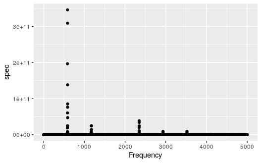

Project Description
==========

  The purpose of this project is to examine whether we can build a model that predicts the instrument being played from a sound recording. This project will utilize data from isolated sound recordings of different instruments being played, with possible predictors relating to unexplained differences in the frequency wave patterns, the modulation of frequency or amplitude over time, or the prevalence of different overtones in the sound. The goal will be to predict the instrument being played based on a test sound recording.

Gathering Data
==========

  The data used to construct this classification model came from clips of audio recordings made in GarageBand. For 5 different instruments, we played and recorded 10 notes (C3, D3, E3, F3, G3, A3, B3, C4, D4, E4) then exported these clips as MP3 files to RStudio. The `tuneR` package provides convenient functions for reading these files as “Wave” objects which contains information about the audio file including the left and right channels, frequency, and amplitude. The five intruments that we collected sound recordings from are the violin, flute, piano, vocals, and the ukulele. 

Data Analysis
==========

  
  
  

  The features that we intend to extract from our observations are some measurement for the attack of the note, some measure of the decay, and some measure of the tonal qualities of the note. By using the periodogram function, we were able to create a function that returns a data frame that identifies the main frequencies in a wave object, along with their relative loudness. This will allow us to investigate the tonal qualities of each instrument. Using the periodogram function, we were able to create a data frame that lists frequencies and their relative loudness in a recording. Below is a plot of this data frame for a violin recording. 
  
  

From here, we made a function that filtered out all points that weren't a local maximum, and that were smaller than 0.01 of the maximum value in the set. The resulting data frame only includes points at the top of nodes seen in the plot above. Below is a plot of this resulting data frame. 

  
  

  To analyze the attack and decay of each note, we started with a data frame that held a measurement for volume over a long list of times. An illustration of this for a Ukulele note is shown below. 
  
  

We then created a function that filtered out all values that weren't local maxima, and then filtered out all values that were smaller than a certain threshold. After this, the function rescaled the units of time to actually reflect time in seconds. It also rescaled the height to have a maximum of one, allowing us to compare the decay of a note without worrying about its actual volume. The resulting data frame is illustrated below. 

  

Our intent is to then cut this data frame into separate "attack" and "decay" sets, and then potentially classify instruments by their attack and decay as either "plucked", "hammered", or "sustained" by fitting different types of regression models to each data set and calculating the MSE for each type. 

