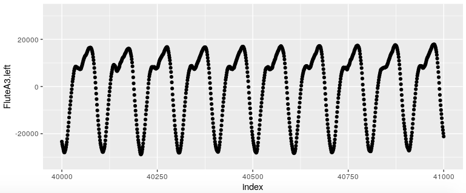
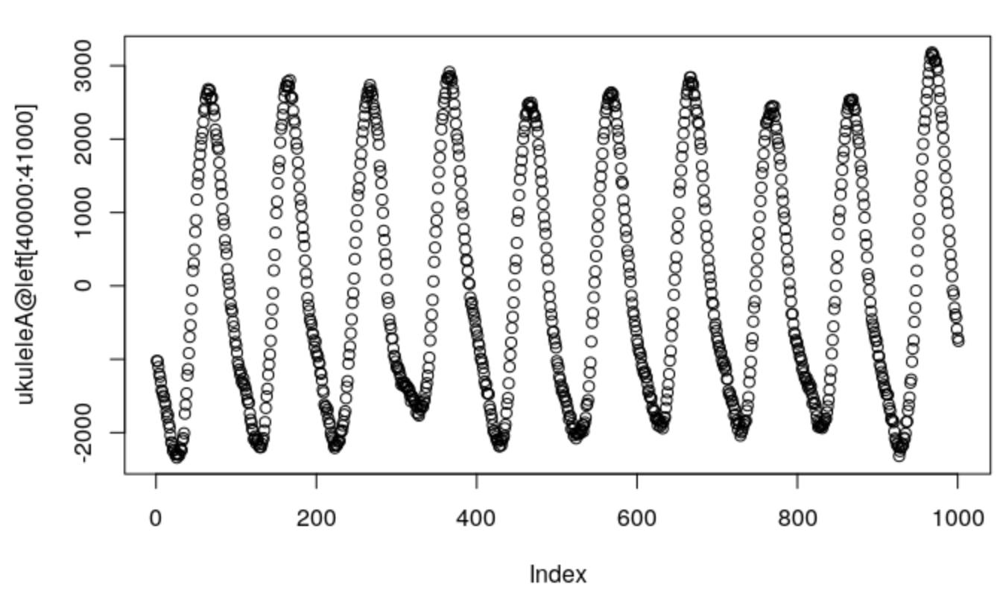

Instrument Classification
================
Noland Anderson, Tim Shinners, Sarah Maebius

Project Description
===================

The purpose of this project is to examine whether we can build a model that predicts the instrument being played from a sound recording. This project will utilize data from isolated sound recordings of different instruments being played, with possible predictors relating to unexplained differences in the frequency wave patterns, the modulation of frequency or amplitude over time, or the prevalence of different overtones in the sound. The goal will be to predict the instrument being played based on a test sound recording.

Gathering Data
==============

The data used to construct this classification model came from clips of audio recordings made in GarageBand. For 5 different instruments, we played and recorded 10 notes (C3, D3, E3, F3, G3, A3, B3, C4, D4, E4) then exported these clips as MP3 files to RStudio. The `tuneR` package provides convenient functions for reading these files as “Wave” objects which contains information about the audio file including the left and right channels, frequency, and amplitude. The five intruments that we collected sound recordings from are the violin, flute, piano, vocals, and the ukulele.

Data Analysis
=============

  
